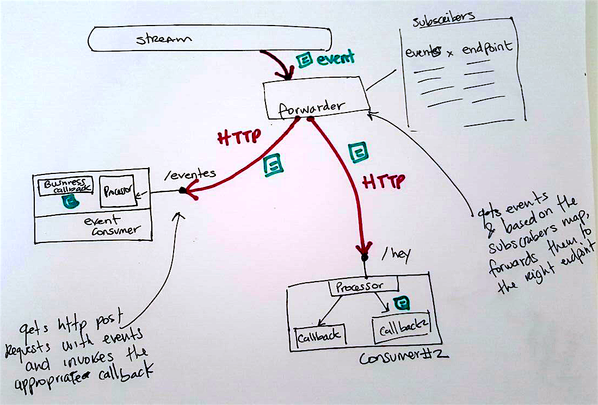

# NodeJS consumer-client Spike

## Background.
AWS Kinesis consumers need to be constantly polling the stream for new events (with a dedicated thread for it).
NodeJS will struggle with this as it is single-threaded.

So, the solution I'm spiking out is to create a dedicated function for polling the stream, and once it gets a new event from Kinesis, it will notify the consumers
through HTTP requests.



### Components
* An AWS Lambda that will listen to the Kinesis stream and notify the subscribers
* A consumer with an endpoint enabled to get the http requests from the lambda
* An npm module to map the http requests with the event to a specific callback.

## Usage
To see how the module would work (locally):

1. Install dependecies:

  `npm i`

1. Run the consumer:

  `node test/consumer-client.js`

1. Simulate an event sent by the [forwarder lambda](forwarder/handler.js).

  1. In a different shell, run:

    `node test/forwarder-lambda.js`

  1. If your computer acts up like mine did, and you don't want to put in the effort on figuring out why, then do this:

    ``` bash
    curl -X POST -H "Content-Type: application/json" \
    -d '{ "channel": "member-registered","sequenceNumber": "49569625073747986051284015760176917265900404709609439234","data": "we are streaming events","approximateArrivalTimestamp": 1485507652.516 }' \
    http://localhost:3000/events
    ```

## To deploy an event broadcaster Lambda

### Pre-requisites

* [AWS Account all setup]
* [A Kinesis Stream](https://aws.amazon.com/kinesis/streams/)
* [Serverless]

Then run:

`STREAM_ARN="<the-stream-arn>" sls deploy`

_This still does not include runtime registration, so there is no code for the potential registrar lambda._


## Pending
* Setup a consumer with an internet-facing endpoint.
* Hardcode the endpoint vs eventType
* Be consistent with the names.

[Serverless]: https://serverless.com/
[AWS Account all setup]: https://docs.aws.amazon.com/cli/latest/userguide/cli-chap-getting-started.html
